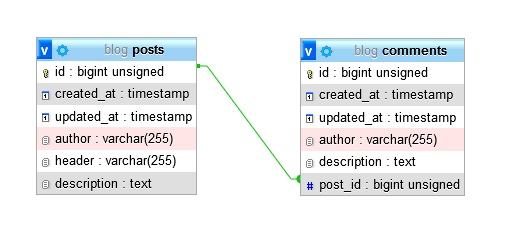

# Тестовое задание “Блог”

## Описание

● На главной странице должны отображаться последние посты отсортированные по
дате, последние первыми.

● В списке постов необходимо вывести дату и время,
заголовок, автора, кол-во комментариев.

● На заголовке должна быть ссылка для
перехода на страницу поста.

● На странице поста должны отображаться: дата и время поста, заголовок, автор, текст
поста.

● Ниже необходимо вывести все комментарии, последние первыми. Для
комментариев вывести дату и время, автора, текст комментария.

● Ниже комментариев должна располагаться форма отправки комментария. Поля: автор,
текст.

● Все поля обязательные, рядом с полями вывести ошибки валидации (например,
“Автор не может быть пустым”).

● В шапке разместить ссылку на добавление поста, ведущую на страницу с формой.
Поля формы: автор, заголовок, текст.

● Все поля обязательные. Рядом с полями
выводить ошибки валидации.

● После успешной отправки формы, необходимо
перенаправить на страницу поста.

## Требования:

● использовать PHP 8.2, Mysql 8;

● использовать Symfony 6 либо Laravel 10 фреймворк, либо можно собрать
проект из отдельных composer-пакетов;

● использовать Doctrine/Eloquent;

● можно использовать любой bootstrap-фреймворк для верстки, можно взять
готовые шаблоны;

● учесть проблему N+1 при запросе списка постов (связь с комментариями), т.е.
чтобы с увеличением количества постов не увеличивалось кол-во запросов;

● использовать миграции;

● учесть защиту от различного рода хакерских атак;

● результат выложить на github, комиты должны иметь осмысленные
комментарии согласно реализованному функционалу, просто один “initial
commit” не принимается;

● будет плюсом, если проект будет развернут на хостинге для демонстрации
работы;

## Окружение

- PHP 8.2.5
- MySQL - 8.0.24
- Laravel Framework 10.8.0

## Действия при запуске

Создать бд. Название при разработке было blog

Настроить файл .env в части подключения к бд.

Выполнить миграции.

Схема бд:

